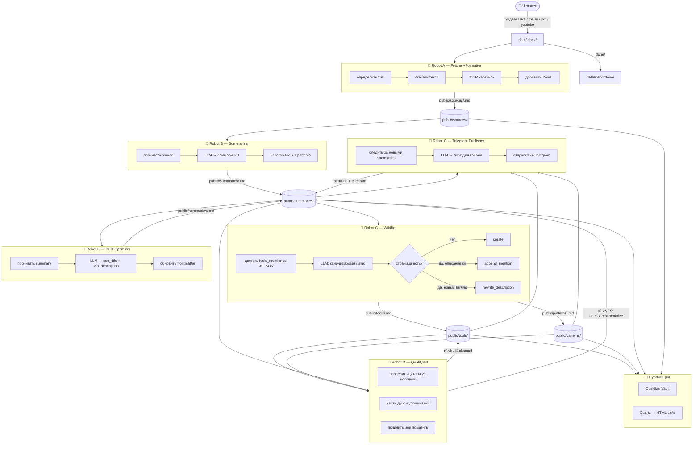

# Процессы и роботы

## Общая картина



---

## Роботы

### Robot A — Fetcher+Formatter

**Запуск:** `python -m guides.pipelines.a_ingest`
**Триггер:** новые файлы в `data/inbox/`
**Идемпотентен:** да (пропускает если `state[slug].raw == true`)

| Тип входа | Как скачивает | Модель |
|---|---|---|
| URL статья | defuddle-cli → cloudflare-markdown → jina | не нужна |
| `.md` файл | читает напрямую | не нужна |
| `.pdf` файл | pdftotext → LLM OCR fallback | **gpt-5.4** (только OCR) |
| YouTube URL | yt-dlp субтитры → khabaroff.studio API | не нужна |
| GitHub repo | GitHub API → README | не нужна |
| GitHub gist | GitHub API → jina fallback | не нужна |

OCR картинок внутри статьи: **gpt-5.4-mini** (дёшево, per-image, с SQLite-кешем).

---

### Robot B — Summarizer

**Запуск:** `python -m guides.pipelines.b_summarize`
**Триггер:** новые файлы в `public/sources/`
**Идемпотентен:** да (пропускает если `public/summaries/<slug>.md` существует)

Промпт: `prompts/summary.md`

**Модель по размеру:**
- статья < 15K токенов → **gpt-5.4-mini** ($0.01-0.03)
- статья ≥ 15K токенов → **gpt-5.4** (длинный контекст, точнее)

**Retry:** до 3 попыток если LLM не вернул корректный frontmatter. При финальном сбое — `quality: needs_review`.

Выход — markdown с YAML frontmatter:
```yaml
---
slug: article-slug
source_url: https://...
source_type: article
summarized_at: 2026-05-13
tools: [Claude Code, LangChain]
patterns: [Context Engineering, ReAct]
key_claims:
  - тезис 1
lecture_hooks:
  - вопрос для аудитории
---
```

Тело использует `[[Claude Code]]` и `[[Context Engineering]]` как wikilinks.

---

### Robot C — WikiBot

**Запуск:** `python -m guides.pipelines.c_wiki_update`
**Триггер:** новые файлы в `public/summaries/`
**Идемпотентен:** да (`state[slug].wiki_propagated`)

Промпт: `prompts/wiki_tool_update.md`
**Модель:** всегда **gpt-5.4-mini** (короткие запросы, дедуп по семантике)

Вход: `tools` и `patterns` списки из frontmatter саммари (plain names, не JSON-блок).

Три режима:
- `create` — новая страница инструмента/паттерна
- `append_mention` — добавить упоминание
- `rewrite_description` — переписать «Что это» если новый взгляд

Саммари с `quality: needs_review` обрабатываются как обычно, просто tools/patterns будут пустыми.

---

### Robot D — QualityBot

**Запуск:** `python -m guides.pipelines.d_quality_check`
**Триггер:** периодически (не блокирует A/B/C)
**Модель:** всегда **gpt-5.4-mini** (дёшево)

Два режима:
- `summary_check` — проверяет цитаты в исходнике, ловит галлюцинации
- `wiki_clean` — дедуп упоминаний, противоречия в описаниях

---

### Robot E — SEO Optimizer

**Запуск:** `python -m guides.pipelines.e_seo`
**Триггер:** новые файлы в `public/summaries/`
**Идемпотентен:** да (`state[slug].seo_optimized`)

**Модель:** gpt-5.4-mini
**Промпт:** `prompts/seo.md`

Генерирует SEO-поля для frontmatter саммари: `seo_title` (≤60 символов), `seo_description` (≤160 символов), `og_description`. Используется Quartz/Astro для `<head>` мета-тегов.

---

### Robot G — Telegram Publisher

**Запуск:** `python -m guides.pipelines.g_telegram`
**Триггер:** новые файлы в `public/summaries/` без `published_telegram`
**Идемпотентен:** да (`state[slug].published_telegram`)

**Промпт:** `prompts/telegram_post.md`
**Config:** `TELEGRAM_BOT_TOKEN` + `TELEGRAM_CHANNEL_ID` в `.env`

Постит одну статью за раз в канал: bold заголовок + tldr + 2-3 тезиса + ссылки. Ставит `state[slug].published_telegram = ISO date`. `--dry-run` для превью без публикации.

---

## State Machine (guides-y7n)

Сейчас: `state/index.json` — плоский JSON.
Будущее: SQLite `state/articles.db`, таблица `articles`:

| Поле | Тип | Смысл |
|---|---|---|
| slug | TEXT PK | идентификатор |
| raw | INTEGER | Pipeline A выполнен |
| summarized_at | TEXT | дата Pipeline B |
| wiki_propagated | INTEGER | Pipeline C выполнен |
| seo_optimized | INTEGER | Pipeline E выполнен |
| published_telegram | TEXT | дата публикации |
| quality | TEXT | ok / needs_review |

Позволяет запросы типа: `SELECT slug WHERE seo_optimized=0 AND quality='ok'`.

---

## Модели и стоимость

| Задача | Модель | Цена за единицу |
|---|---|---|
| OCR картинки (vision) | gpt-5.4-mini | ~$0.005 |
| OCR PDF страницы | gpt-5.4 | ~$0.02 |
| Саммари < 15K токенов | gpt-5.4-mini | ~$0.01-0.03 |
| Саммари ≥ 15K токенов | gpt-5.4 | ~$0.05-0.15 |
| WikiBot update | gpt-5.4-mini | ~$0.003 |
| QualityBot check | gpt-5.4-mini | ~$0.005 |

---

## Крон-расписание (TODO: настроить)

```
# каждые 15 минут — полный цикл
*/15 * * * * cd /path/to/guides && python -m guides.pipelines.run_all >> logs/cron.log 2>&1
```

Или через Codex CLI:
```bash
codex run "python -m guides.pipelines.run_all"
```

---

## Перекрёстные ссылки

Страница инструмента ссылается на все саммари где упоминается:
```markdown
## Упоминания
- [Karpathy Second Brain](../../summaries/karpathy-second-brain.md) — "цитата"
- [Building Effective AI Agents](../../summaries/building-effective-ai-agents.md) — "цитата"
```

Саммари ссылается обратно на source:
```markdown
source: [оригинал](../../sources/karpathy-second-brain.md)
```

Всё внутри `public/` — относительные ссылки. Obsidian их видит как граф.

---

## YouTube — два способа

1. **yt-dlp** — скачивает `.vtt` субтитры локально (en → ru → all)
2. **khabaroff.studio API** — fallback если yt-dlp не справился:
   `GET https://youtubetranscribe.khabaroff.studio/?url=<youtube_url>`
   (TODO: уточнить endpoint из /docs)