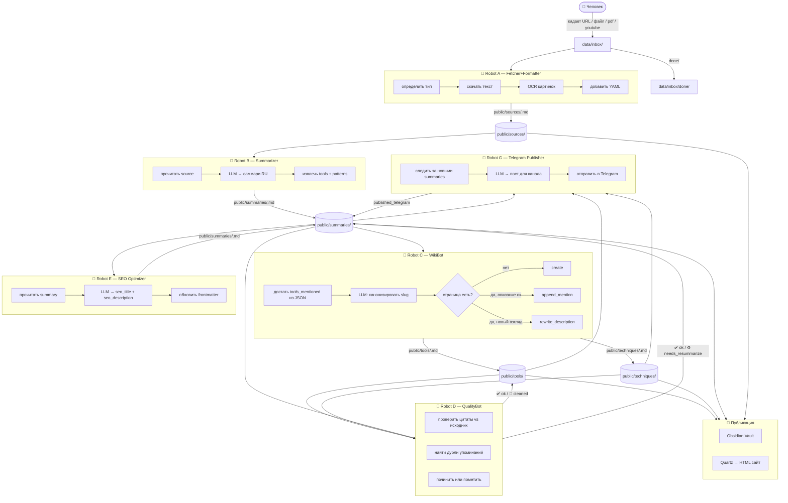

# Процессы и роботы

## Общая картина



---

## Роботы

### Robot A — Fetcher+Formatter

**Запуск:** `python -m guides.pipelines.a_ingest`
**Триггер:** новые файлы в `data/inbox/`
**Идемпотентен:** да (пропускает если `state[slug].raw == true`)

| Тип входа | Как скачивает | Модель |
|---|---|---|
| URL статья | defuddle-cli → cloudflare-markdown → jina | не нужна |
| `.md` файл | читает напрямую | не нужна |
| `.pdf` файл | pdftotext → LLM OCR fallback | **gpt-5.4** (только OCR) |
| YouTube URL | yt-dlp субтитры → khabaroff.studio API | не нужна |
| GitHub repo | GitHub API → README | не нужна |
| GitHub gist | GitHub API → jina fallback | не нужна |

OCR картинок внутри статьи: **gpt-5.4-mini** (дёшево, per-image, с SQLite-кешем).

---

### Robot B — Summarizer

**Запуск:** `python -m guides.pipelines.b_summarize`
**Триггер:** новые файлы в `public/sources/`
**Идемпотентен:** да (пропускает если `public/summaries/<slug>.md` существует)

Промпт: `prompts/summary.md`

**Модель по размеру:**
- статья < 15K токенов → **gpt-5.4-mini** ($0.01-0.03)
- статья ≥ 15K токенов → **gpt-5.4** (длинный контекст, точнее)

**Retry:** до 3 попыток если LLM не вернул корректный frontmatter. При финальном сбое — `quality: needs_review`.

Выход — markdown с YAML frontmatter:
```yaml
---
slug: article-slug
source_url: https://...
source_type: article
summarized_at: 2026-05-13
tools: [Claude Code, LangChain]
patterns: [Context Engineering, ReAct]
key_claims:
  - тезис 1
lecture_hooks:
  - вопрос для аудитории
---
```

Тело **обязательно** начинается с секции `## TL;DR` (1-2 предложения) — Pipeline E парсит её через regex для SEO-описания. Далее идут стандартные 10 секций (Идеи, Ключевые тезисы, Цитаты, Факты, Рекомендации, Метафоры, Q&A, Упоминания, Для лекции).

Wikilinks `[[Claude Code]]` и `[[Context Engineering]]` — только для имён из `tools`/`patterns` во frontmatter.

---

### Robot C — WikiBot

**Запуск:** `python -m guides.pipelines.c_wiki_update`
**Триггер:** новые файлы в `public/summaries/`
**Идемпотентен:** да (`state[slug].wiki_propagated`)

Промпт: `prompts/wiki_tool_update.md`
**Модель:** всегда **gpt-5.4-mini** (короткие запросы, дедуп по семантике)

Вход: `tools` и `patterns` списки из frontmatter саммари (plain names, не JSON-блок).

Куда пишет:
- `tool` → `public/tools/<slug>.md`
- `pattern` → `public/techniques/<slug>.md` (директория называется `techniques`, тип во frontmatter — `pattern`)

Три режима:
- `create` — новая страница. LLM возвращает `page_md=""` → пайплайн собирает страницу сам из имени + упоминания.
- `append_mention` — добавить упоминание. `page_md=""`, пайплайн дописывает строку в `## Упоминания`.
- `rewrite_description` — новый взгляд → LLM **обязан** вернуть полный `page_md` с секциями `## Что это` и `## Упоминания` (пайплайн парсит regex'ом).

Секция описания всегда называется `## Что это` — и для tool, и для pattern. Никаких `## Суть`.

Саммари с `quality: needs_review` обрабатываются как обычно, просто tools/patterns будут пустыми.

---

### Robot D — QualityBot

**Запуск:** `python -m guides.pipelines.d_quality_check [--mode summary|wiki|both] [--slug SLUG]`
**Триггер:** периодически (не блокирует A/B/C)
**Модель:** всегда **gpt-5.4-mini** (дёшево)
**Промпт:** `prompts/quality_check.md`
**Отчёт:** `state/quality-report.json`

Два режима с конкретными критериями:

- `summary_check` — сверка `public/sources/<slug>.md` ↔ `public/summaries/<slug>.md`. Проверяет:
  - TL;DR честно отражает главную мысль исходника
  - tools/patterns не пропущены
  - цитаты verbatim (не перефразированы)
  - нет галлюцинаций (имена, цифры, продукты — существуют в исходнике)
  - frontmatter валидный YAML
  - Verdict: `ok` / `minor_fix` / `needs_resummarize`

- `wiki_clean` — чистка `public/tools/*.md` и `public/techniques/*.md`. Ловит дубликаты упоминаний, битые ссылки, противоречия описание↔упоминания, короткие описания при ≥2 упоминаниях, транслитерацию имён.
  - Verdict: `ok` / `needs_cleanup`. При `needs_cleanup` промпт возвращает `cleaned_page_md` — пайплайн перезаписывает страницу.

---

### Robot E — SEO Optimizer

**Запуск:** `python -m guides.pipelines.e_seo`
**Триггер:** новые файлы в `public/summaries/`
**Идемпотентен:** да (`state[slug].seo_optimized`)

**Модель:** gpt-5.4-mini
**Промпт:** `prompts/seo.md`

Генерирует SEO-поля для frontmatter саммари: `seo_title` (≤60 символов), `seo_description` (≤160 символов), `og_description`. Используется Quartz/Astro для `<head>` мета-тегов.

---

### Robot G — Telegram Publisher

**Запуск:** `python -m guides.pipelines.g_telegram`
**Триггер:** новые файлы в `public/summaries/` без `published_telegram`
**Идемпотентен:** да (`state[slug].published_telegram`)

**Промпт:** `prompts/telegram_post.md`
**Config:** `TELEGRAM_BOT_TOKEN` + `TELEGRAM_CHANNEL_ID` в `.env`

Постит одну статью за раз в канал в авторском голосе Сергея (исследователь-практик, думающий вслух — стиль из `_PLAYFULNESS/style/style-guide-personal-llm.md`):
- 150-400 слов, спиральная формула (наблюдение → рефлексия → концептуализация → вопрос)
- Bold-заголовок-крючок + спиральный текст + 🔗 источник + 📝 саммари (если URL известен)
- Без буквы «ё», без «ты»-обращения, без директивных CTA, авторские маркеры (`поботать`, `критмыш` и т.д.) — максимум один на пост и только органично

Ставит `state[slug].published_telegram = ISO timestamp`. `--dry-run` для превью без публикации.

---

## State Machine

Хранилище: `state/articles.db` (SQLite). Таблица `articles`, схема мигрируется при старте автоматически. Текущие колонки:

| Поле | Тип | Смысл |
|---|---|---|
| slug | TEXT PK | идентификатор |
| raw | INTEGER | Pipeline A выполнен |
| summarized_at | TEXT | дата Pipeline B |
| content_hash | TEXT | SHA-256 исходника (детект изменений) |
| wiki_propagated | INTEGER | Pipeline C выполнен |
| wiki_propagated_at | TEXT | дата Pipeline C |
| quality_checked | INTEGER | Pipeline D прогнал |
| seo_optimized | INTEGER | Pipeline E выполнен |
| published_telegram | TEXT | ISO timestamp публикации |
| quality | TEXT | ok / needs_review |

Запросы вида: `SELECT slug FROM articles WHERE seo_optimized=0 AND quality='ok'`.

**Руками не править.** Чтение через `guides.state.get_state(slug)`, запись через `set_state(slug, key, value)`.

---

## Модели и стоимость

| Задача | Модель | Цена за единицу |
|---|---|---|
| OCR картинки (vision) | gpt-5.4-mini | ~$0.005 |
| OCR PDF страницы | gpt-5.4 | ~$0.02 |
| Саммари < 15K токенов | gpt-5.4-mini | ~$0.01-0.03 |
| Саммари ≥ 15K токенов | gpt-5.4 | ~$0.05-0.15 |
| WikiBot update | gpt-5.4-mini | ~$0.003 |
| QualityBot check | gpt-5.4-mini | ~$0.005 |

---

## Крон-расписание (TODO: настроить)

```
# каждые 15 минут — полный цикл
*/15 * * * * cd /path/to/guides && python -m guides.pipelines.run_all >> logs/cron.log 2>&1
```

Или через Codex CLI:
```bash
codex run "python -m guides.pipelines.run_all"
```

---

## Перекрёстные ссылки

Страница инструмента ссылается на все саммари где упоминается:
```markdown
## Упоминания
- [Karpathy Second Brain](../../summaries/karpathy-second-brain.md) — "цитата"
- [Building Effective AI Agents](../../summaries/building-effective-ai-agents.md) — "цитата"
```

Саммари ссылается обратно на source:
```markdown
source: [оригинал](../../sources/karpathy-second-brain.md)
```

Всё внутри `public/` — относительные ссылки. Obsidian их видит как граф.

---

## YouTube — два способа

1. **yt-dlp** — скачивает `.vtt` субтитры локально (en → ru → all)
2. **khabaroff.studio API** — fallback если yt-dlp не справился:
   `GET https://youtubetranscribe.khabaroff.studio/?url=<youtube_url>`
   (TODO: уточнить endpoint из /docs)